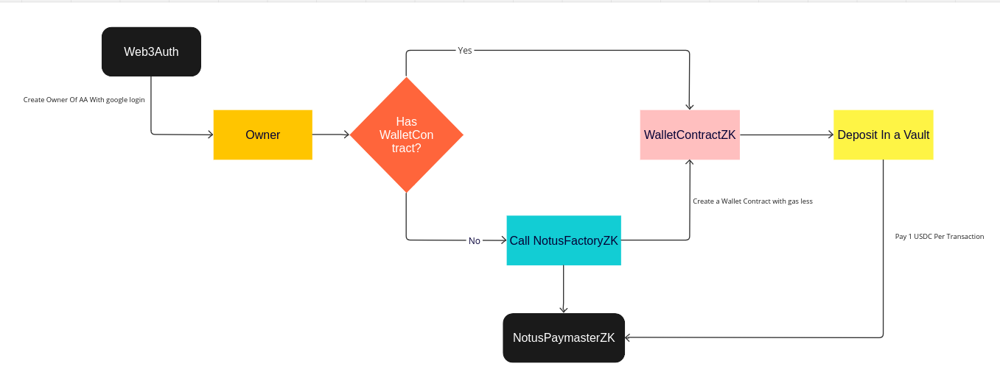

# Notus Wallet Contract

## Description

**Notus Wallet Contract** is an innovative project that leverages smart contract technology to revolutionize the way transactions and payments are processed on the zkSync Era network. By combining the flexibility of smart contracts with the efficiency and scalability of the zkSync network, the project introduces an advanced approach to handling ERC20 token transactions and contract creation.

### Key Features

The **Notus Wallet Contract** project consists of two main smart contracts:

1. **Smart Contract Factory**: This factory contract enables the dynamic creation of new smart contracts (AA).

2. **Paymaster with ERC20 Token Support**: The paymaster contract is responsible for accepting transaction fee payments using an ERC20 token. This offers a convenient and flexible way for users to pay for transactions on the zkSync Era network.

### Account Abstraction and zkSync Era

A distinctive feature of the **Notus Wallet Contract** project is the use of Account Abstraction in conjunction with the zkSync Era network. Account Abstraction allows transactions to be executed without the need for native token balance, as transaction costs are deducted directly from the paymaster.

The zkSync Era network, known for its scalability and low fees, provides the ideal environment for implementing these advanced smart contracts. It enables the execution of contracts with high performance and a seamless user experience.

### Technologies Used

- Solidity: Programming language for writing smart contracts.
- Hardhat: Framework for Ethereum contract development and testing.
- zkSync: Layer 2 protocol that offers scalability and low fees for Ethereum transactions.
- zksync-web3: ramework for provide easy access to all of the features of zkSync Era
- era-test-node: In-Memory Node for local testing.

### Installation and Execution

1. Clone this repository: `git clone git@github.com:notuslabs/notus-wallet-contract.git`
2. Navigate to the directory: `cd notus-wallet-contract`
3. Install dependencies: `yarn`
4. Compile contracts: `npx hardhat compile`

## Smart Contracts

### Mainnet Contracts

| Contract Name        | Mainnet Address                             |
|----------------------|---------------------------------------------|
| NotusWalletFactoryZK(Mainnet) | [`0x30279b1886686C81aF98F210d81C2b66a232A17a`](https://explorer.zksync.io/address/0x30279b1886686C81aF98F210d81C2b66a232A17a#contract)            |
| NotusPaymasterZK (Mainnet)   | [`0xB5eE31790e7CaF6266a94B2598bEe05954C00CbC`](https://explorer.zksync.io/address/0xB5eE31790e7CaF6266a94B2598bEe05954C00CbC)         |
| USDC (Mainnet)   | [`0x3355df6d4c9c3035724fd0e3914de96a5a83aaf4`](https://explorer.zksync.io/address/0x3355df6d4c9c3035724fd0e3914de96a5a83aaf4)          |

Example of a NotusWalletZK deployed (Mainnet) [`0x5655A5339E18589Fdc50dE3cB8d402Cc08bc3a2F`](https://explorer.zksync.io/address/0x5655A5339E18589Fdc50dE3cB8d402Cc08bc3a2F#contract)

## Work Flux
